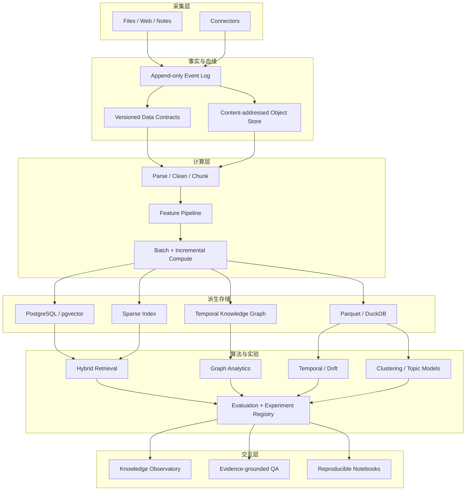

# Memory OS V2：认知数据系统

> 状态：V2 权威架构。2026-08-10 起，新模块以本文为准；V1 文档只描述迁移前系统。

## 1. 目标

Memory OS V2 是一个个人认知数据系统，也是数据科学实验场。它接收长期、多模态、不断变化的信息流，维护可追溯的数据版本，在同一批数据上运行检索、图分析、时间序列、主题建模和 RAG 实验，最后把结论还原到证据。

它不以短期上线或多人使用为硬约束。完成度用四件事判断：

- 算法能从原始数据运行到结果，不靠手填演示数据。
- 每个结果有数据版本、参数、代码版本和指标。
- 可以复现实验，能比较 baseline、改进方案和消融组。
- UI 展示中间状态、失败案例和不确定性，不只展示答案。

## 2. 为什么它能体现数据科学能力

普通 RAG 项目通常只完成「切块 → embedding → 向量库 → LLM」。V2 要处理更难的部分：数据质量、重复与漂移、混合检索、排序评测、图结构、时间变化、模型校准和数据血缘。

### 自己实现

- 中英混合 tokenizer、倒排索引、BM25、RRF 和查询解释。
- Recall@K、MRR、MAP、nDCG、置信区间、bootstrap 显著性检验。
- MinHash/LSH 近重复检索，在线统计与数据漂移检测。
- PageRank、连通分量、社区发现的教学实现。
- K-means、层次聚类、PCA/SVD 的小规模参考实现。
- 检索评测集、负样本挖掘、消融实验和错误切片。

### 使用成熟基础设施

- 不手写数据库、对象存储、TLS、任务队列和浏览器渲染。
- PostgreSQL/pgvector 管在线状态，Parquet/DuckDB 管离线分析。
- MinIO/S3 保存原始对象，OpenTelemetry 记录链路。
- 成熟模型用于 embedding、rerank 和生成；重点是数据与评测系统。

这个取舍类似手搓 CPU 时自己做数据通路和控制逻辑，但不会先烧硅片。

## 3. 系统全景



## 4. 仓库结构

```text
memory-os/
├── apps/
│   └── web/                      Next.js 交互层，V1 src/ 最终迁入
├── services/
│   ├── intelligence/             Python 算法与评测内核
│   ├── ingestion/                解析、清洗、分块、血缘
│   └── orchestrator/             任务 DAG、重试、幂等
├── packages/
│   ├── contracts/                JSON Schema + TS/Python 生成类型
│   ├── event-log/                追加事件接口与 adapter
│   └── observability/            trace、metric、experiment context
├── experiments/
│   ├── datasets/                 查询、相关性标注、数据卡
│   ├── retrieval/                baseline 与消融配置
│   ├── graph/
│   └── temporal/
├── notebooks/                    只做探索；稳定逻辑必须回到 services
├── infra/                        Docker Compose、迁移、监控配置
└── docs/                         ADR、实验报告、方法说明
```

迁移期保留现有 `src/`。新内核先放进 `services/intelligence/`，等契约稳定后再移动 Web。不要先做目录大搬家；先让事件与数据契约切断旧存储实现。

## 5. 深模块和接口

| 模块 | 外部接口 | 隐藏的实现 |
|---|---|---|
| Event log | `append(event)`、`read(stream, cursor)` | 序列号、幂等、并发、adapter |
| Ingestion | `ingest(source)` | MIME 识别、解析、清洗、分块、内容哈希、血缘 |
| Feature pipeline | `materialize(dataset, spec)` | 增量计算、缓存、schema 演化、失败恢复 |
| Retrieval | `build(documents)`、`search(query, config)` | tokenizer、BM25、向量、RRF、rerank、解释 |
| Graph | `project(snapshot)`、`analyze(algorithm)` | 实体消歧、边权、时间切片、图算法 |
| Experiment | `run(spec)`、`compare(runs)` | 数据版本、参数、指标、bootstrap、artifact |
| Intelligence | `answer(question, policy)` | 检索计划、证据预算、生成、校准、引用 |

模块的 interface 是测试面。算法内部可以有多个实现，但 Web 不知道模型名、索引细节或存储表。

## 6. 数据模型：事件先于状态

V1 直接覆盖 `memories` 行，无法回答“哪次解析产生了这段文本”“哪个模型导致指标变化”。V2 先写不可变事件，再投影出当前状态。

### 核心事件

```text
SourceCaptured
SourceContentStored
DocumentParsed
ChunkingCompleted
FeaturesMaterialized
EmbeddingComputed
EntitiesResolved
IndexBuilt
ExperimentStarted
ExperimentCompleted
AnswerGenerated
FeedbackRecorded
```

每个事件至少包含：`event_id`、`stream_id`、`sequence`、`occurred_at`、`schema_version`、`causation_id`、`correlation_id`、`payload_hash` 和 `payload`。

### 关键实体

- `source`：原始来源和内容哈希。
- `document_version`：一次可复现的解析结果。
- `chunk`：由 chunker 版本和参数决定的文本片段。
- `feature_vector`：特征规范、维度、模型版本和数值。
- `entity` / `relation_observation`：带时间和置信度的图观测。
- `dataset_snapshot`：固定数据版本集合。
- `experiment_run`：数据快照、代码 commit、参数、指标和 artifact。
- `judgment`：query-document 相关性等级及标注来源。

## 7. 数据科学工作台

### 数据观测

- 完整度：标题、正文、摘要、关键词、来源的加权覆盖。
- 新鲜度：按 90 天半衰期进行指数衰减。
- 多样性：模态分布的 Shannon 熵；HHI 显示集中度。
- 重复：中英混合指纹的 Jaccard baseline，随后用 MinHash/LSH 扩展。
- 漂移：PSI、Jensen-Shannon divergence、KS 检验与变点检测。

### 检索实验

baseline 顺序固定：

1. Most-recent 与 title substring。
2. 自研 BM25。
3. Dense retrieval。
4. BM25 + dense 的 RRF。
5. Hybrid + cross-encoder rerank。
6. Graph-aware 和 temporal-aware retrieval。

每次改动必须报告 Recall@5/10、MRR、nDCG@10、P95 延迟、索引体积和单查询成本。总分上升但关键切片下降，不能算成功。

### 图与时间

- 节点：document、chunk、entity、topic、decision、question。
- 边是带来源、置信度和有效时间的 observation，不把模型猜测写成事实。
- 支持 PageRank、社区发现、桥接节点、路径解释、图快照差分。
- 按事件时间和摄取时间双时间建模，避免迟到数据改写历史。

### RAG 与生成

生成是最后一层。回答对象包含 `claim → evidence → retrieval score → model confidence`，而不是一段裸文本。评测拆成检索召回、证据充分性、引用正确性、回答忠实度和拒答准确率。

## 8. 十阶段学习路线

| 阶段 | 要做的东西 | 理论与算法 | 可展示成果 |
|---|---|---|---|
| 0 | 数据契约、事件日志、内容寻址 | 幂等、哈希、schema evolution | 同一原始资料可重放 |
| 1 | 数据观测台 | 熵、HHI、衰减、回归、Jaccard | 可解释数据质量报告 |
| 2 | 文档管线 | chunking、去重、数据血缘 | 从原文到 chunk 的 DAG |
| 3 | 稀疏检索 | 倒排索引、BM25、查询解释 | 自研搜索引擎 baseline |
| 4 | 检索评测 | MRR、MAP、nDCG、bootstrap | 可复现实验排行榜 |
| 5 | 向量与混合检索 | embedding、ANN、RRF、rerank | 完整消融实验 |
| 6 | 时序知识图谱 | 实体消歧、PageRank、社区发现 | 可回放关系演化 |
| 7 | 主题与漂移 | PCA/UMAP、聚类、变点检测 | 兴趣迁移与异常解释 |
| 8 | 证据型 RAG | 校准、忠实度、拒答 | claim 级证据链 |
| 9 | 分布式与可观测 | 队列、背压、幂等、trace | 故障注入与恢复报告 |

每阶段保留一份方法说明、一组测试、一套数据卡和一份失败案例。展示项目时按“问题 → baseline → 实验 → 误差分析 → 结论”讲，而不是按页面数量讲。

## 9. 当前实现

- Web 中列已有 DATA/OPS 双视图。
- DATA 视图实现加权完整度、指数衰减新鲜度、Shannon 熵、HHI、OLS 活动趋势和中英混合 Jaccard 重复检测。
- `EventLedger` 已实现不可变 stream sequence、stream 枚举、canonical payload hash 和 SHA-256 内容寻址；IndexedDB 与内存 adapter 共享一个 interface。
- 记忆创建、更新、删除先提交事件，再由 `MemoryProjectionService` 重放到 V1 存储；单条读取和工作区加载会修复未完成投影。
- Python `memory_intelligence` 已实现中英混合 tokenizer、可解释 BM25、Precision/Recall、MRR、MAP 和 graded nDCG；排序去重和只读数据快照保证指标上界与 run ID 一致。
- `retrieval_seed@1` 已有数据卡、相关性标注、固定 digest、实验 CLI 和首份 baseline 报告。
- V1 MySQL/IndexedDB/LLM 管线仍在运行；客户端保留 IndexedDB 副本和持久化 outbox，MySQL 恢复后按序重放离线变更。

## 10. 下一批工程任务

1. 为历史 V1 记忆生成一次迁移事件；新事件的 memory projection 重放已实现。
2. 将浏览器资料导出为版本化 retrieval dataset，避免只依赖合成数据。
3. 加入 dense adapter 与 RRF，运行 BM25/dense/hybrid 三组消融。
4. 实现 paired bootstrap 和查询错误切片，输出置信区间。
