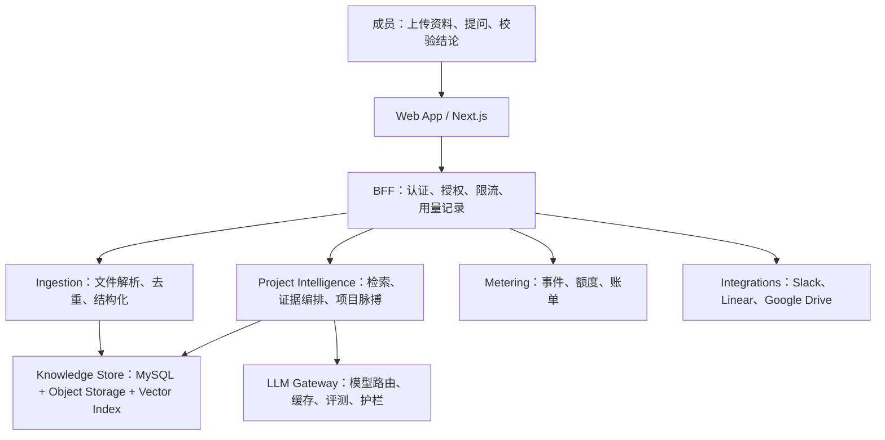

# Memory OS：AI 创业项目重设计

## 产品定义

Memory OS 不再是个人资料箱。它是服务 2–20 人早期团队的 **AI 项目情报系统**：团队把客户访谈、会议纪要、竞品材料、需求和决策放进一个项目空间，系统持续整理事实、显示风险和未决决策，并在讨论时给出可回溯的答案。

先聚焦产品、销售和创始团队。这个群体资料分散、决策频繁，也愿意为节省沟通成本付费。泛“第二大脑”留存弱；“每周少开一次同步会、少漏一个客户承诺”有明确价值。

## 北极星与边界

北极星指标是「每周至少查看一次项目脉搏并打开一条证据的活跃工作区数」。这比上传量更接近产品是否参与了决策。

第一年不做通用协作文档、不替代 Linear/Notion，也不让模型自动执行对外动作。产品负责把项目事实变成可核查的判断，任务执行仍留在团队已有工具中。

## 技术架构

### 模块划分

| 模块 | 对外接口 | 内部职责 | 目前状态 |
|---|---|---|---|
| Workspace identity | `currentWorkspace()` | 用户、工作区、角色、行级隔离 | 待做，当前 folder 只是单用户隔离 |
| Knowledge ingestion | `ingest(source)` | 上传、解析、分块、摘要、去重、索引 | 已有基础解析；任务化和向量索引待做 |
| Project intelligence | `getBrief(workspace)`、`answer(question)` | 聚合证据、风险/行动抽取、RAG、引用 | 项目脉搏第一版已实现 |
| LLM gateway | `generate(request)` | 模型路由、预算、重试、提示版本、评测 | 现有聊天代理是雏形，待收口 |
| Metering | `record(event)`、`checkEntitlement()` | 请求计量、额度、套餐能力 | 待做 |
| Integrations | `sync(connection)` | OAuth、增量拉取、权限映射 | 待做 |

这些模块在代码里要保持深模块：调用者只知道“生成项目脉搏”或“回答并带证据”，不需要知道关键词、向量、重排和模型降级如何组合。`components → hooks → features → storage` 的现有依赖方向继续保留。

### 数据模型升级

现有 `folder_id` 应迁移为 `workspace_id`，并新增：

- `users`、`workspace_members`：身份、角色、成员关系。
- `sources`、`source_chunks`：资料来源、版本、分块、解析状态、嵌入向量。
- `decisions`、`action_items`、`risks`：AI 提取结果，必须带 `evidence_ids` 和人工状态。
- `usage_events`、`subscriptions`：按工作区记录推理、存储和集成消耗。
- `integration_connections`、`sync_cursors`：第三方连接与增量同步。

不要让前端直连这些表。BFF 从登录会话得到 `workspace_id`，在每次查询中强制注入它；存储适配器不再使用 `user_id = "default"`。原有 `folders` 可保留为工作区内项目或资料集，方便平滑迁移。

### AI 可信度和成本控制

- 检索先按工作区过滤，再做关键词、向量和重排；没有证据时明确说不知道。
- 所有结论附带证据卡片，用户能跳回原文。风险和行动只能是“建议”，不能伪装成事实。
- 入库阶段做一次解析、分块和嵌入；问答时按 token 预算取最少必要内容。短问题命中缓存，长文和批量分析走异步任务。
- 记录模型、提示版本、检索命中、延迟、token 和用户是否采纳。用一组脱敏项目集做回归评测。

## 功能规划

### P0：找到付费验证信号（0–6 周）

1. 工作区与成员：邮箱登录、owner/member、资料和会话按工作区硬隔离。
2. 项目资料库：上传 PDF、文本、网页，保留来源与解析状态。
3. 项目脉搏：聚合本周资料、焦点、待推进和风险；每项显示证据。
4. 引用式问答：只使用当前项目资料，答案和原文互相跳转。
5. 基础用量：限制存储、问答和解析次数，记录成本。

验收标准：10 个设计伙伴中至少 6 个团队连续四周每周打开项目脉搏；其中 3 个愿意为持续使用付费。

### P1：把资料变成团队工作流（6–12 周）

1. Slack、Google Drive 和 Linear 连接器，按增量同步。
2. 决策、风险、行动项的确认和负责人状态。
3. 每周项目简报，可复制到 Slack 或邮件；推送由用户手动确认。
4. 语义检索、重排、评测集和异常成本告警。

### P2：形成团队切换成本（3–6 个月）

1. 多项目组合视图和跨项目问题追踪。
2. 模板：客户发现、产品发布、融资准备。
3. 审计日志、数据导出、保留策略和企业 SSO。
4. 专家/顾问外部只读访问，便于把项目上下文带入服务交付。

## 商业模式

| 套餐 | 客群 | 定价建议 | 核心限制 |
|---|---|---:|---|
| Free | 试用团队 | ¥0 | 1 个项目、有限资料和问答额度 |
| Team | 2–20 人早期团队 | ¥99/人/月，最低 3 席 | 项目脉搏、引用问答、主要连接器、共享额度 |
| Growth | 有多项目的公司 | ¥199/人/月 | 更高存储与推理额度、工作流模板、管理员能力 |
| Enterprise | 合规或大团队 | 年度合同 | SSO、审计、数据保留、私有部署/模型路由 |

模型成本不应完全包含在无限套餐里。Team 包含合理的共享 AI 额度，超额按工作区购买；这样与模型成本同向，也避免重度用户吃掉毛利。连接器和团队协作是订阅价值，AI 额度是可变成本。

获客先从设计伙伴切入：找正在做客户访谈、频繁开产品会的创业团队，承诺“每周项目脉搏 + 有证据的决策回顾”，用他们的真实资料完成首批案例。不要先投广告，也不要先做开发者平台。

## 衡量与决策

每周固定看四类数：

- 激活：创建工作区后 48 小时内上传至少 5 条资料并提出一次问题的比例。
- 价值：项目脉搏查看率、证据打开率、确认的行动项数。
- 留存：团队工作区的第 4 周留存，而不是个人登录留存。
- 单位经济：每活跃工作区的模型成本、存储成本、毛利。

如果证据打开率低，先改脉搏的可操作性；如果激活低，缩短首批资料导入路径。别急着加模型或功能。

## 本轮已落地

工作区中列的空态已替换为“项目脉搏”。它读取当前文件夹的资料，生成焦点、待推进和需要处理事项，并始终显示来源。第一版使用可审查的本地规则，不会在缺少模型密钥时失效；后续可将同一个 `createProjectBrief` 接口换成带引用的 LLM 叙事层。
